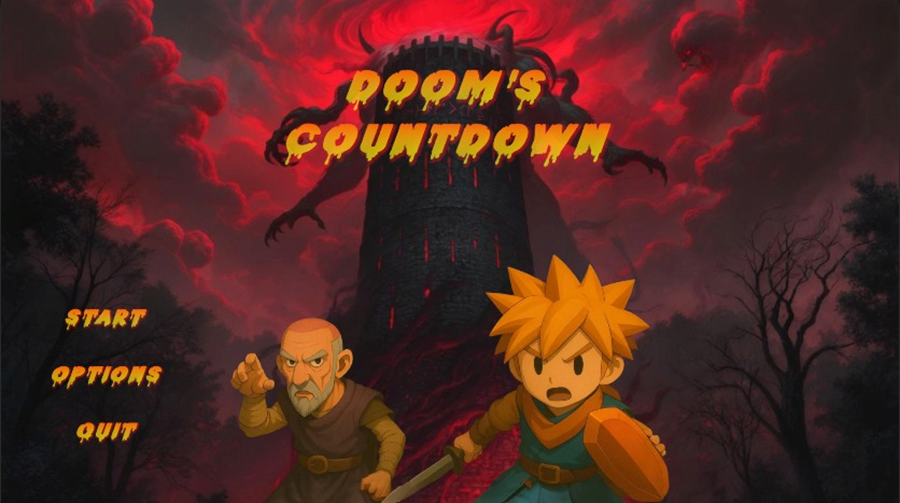
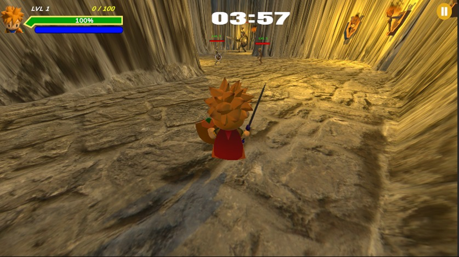
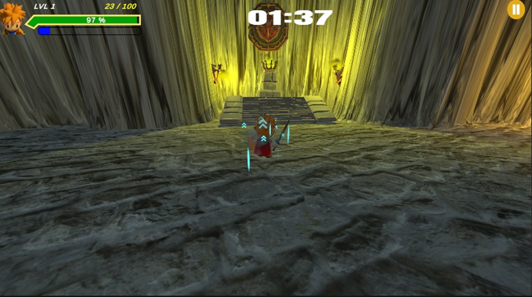
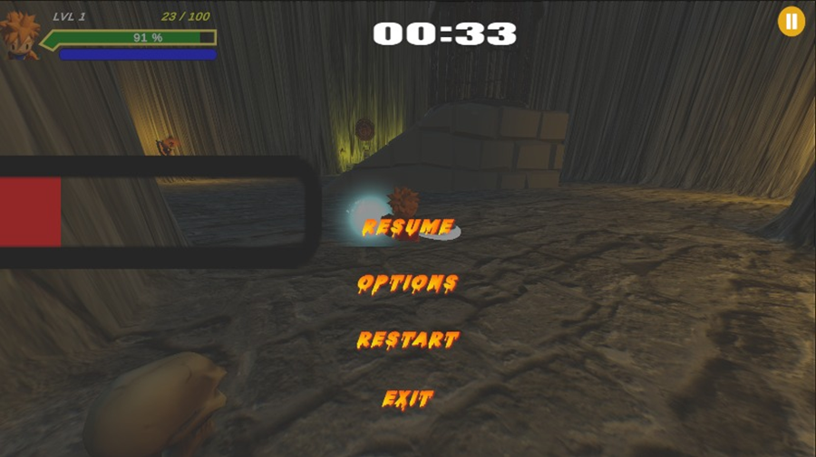

## High Concept Document – Doom’s Countdown

### ❑ What does the player do? (Interactivity)

The player takes on the role of a heroic avatar navigating deadly magical mazes, battling a variety of enemies using magic-based combat, and solving puzzles — all while racing against a global countdown timer.

### ❑ Why do they do it? (Player goal/motivation)

The player's ultimate goal is to stop Hex, a dark sorcerer attempting to complete a catastrophic ritual. Along the way, players are driven by the need to save the world, earn rewards, and grow stronger through progression—fueled by the emotional urgency of preventing the world’s destruction.

### ❑ Where does the player do it? (Setting, story, narration)

The game takes place in a cursed, labyrinthine tower filled with dangerous enemies, hidden traps, mysterious puzzles, and magical energy. The setting grows darker and more threatening as the player progresses, culminating in the final battle against Hex at the ritual site.

### ❑ How does the player do it? (Core mechanics)

The player utilizes a combination of real-time maze navigation, magic-based combat skills, and timed puzzle solving.  
Progression is measured through EXP, which unlocks new levels, and gold, which enables upgrades and purchases.

### ❑ What sort of emotion is this game trying to evoke in the player? (Affect/aesthetics)

Doom’s Countdown aims to evoke tension, urgency, and exhilaration.  
The ticking countdown intensifies decision-making, while the emotional weight of rescuing hostages and the escalating challenge of mazes and boss fights stir feelings of heroism, pressure, and rewarding triumph.

---

## Feature Set

### • Scene Building
- Dark fantasy tower environment with progressively challenging maze-like levels.
- Themed floors (e.g., fire, ice, shadow) to reflect progression and increase visual variety.

### • User Interface (UI)
- Clean and responsive HUD displaying health, EXP, and the global countdown timer.
- Pause menu with options for viewing, controls, and retrying levels.

### • Collision Detection
- Real-time collision for traps, walls, and enemy boundaries.
- Precision-based hit detection for melee attacks.

### • Lighting
- Dynamic lighting to create suspense: torch-lit corridors, flickering spell lights, and glowing magic runes.
- Soft shadows and ambient effects for immersive dungeon atmosphere.

### • Artificial Intelligence (AI)
- Enemy AI varies by type:
  - Skeletons follow basic chase-and-attack patterns.

---

## Innovation / Creativity

### • Unique Gameplay Mechanics
- Integrated countdown system adds high-stakes urgency to all actions, encouraging efficient decision-making.
- EXP-based progression system rewards player skill.

### • Immersive Environment
- A cursed, magical tower with distinct visual themes and hazards on each floor.
- Hidden rooms and alternate routes reward exploration and replayability.

### • Emotional Engagement
- Constant threat of failure from the ticking timer creates relentless tension.
- The combination of fast-paced action, evolving environments, and narrative pressure delivers a gripping, high-reward experience.

---

## User Manual

### How to Play

#### Movement Controls:
- `W` / `Up Arrow` – Move Forward  
- `S` / `Down Arrow` – Move Backward  
- `A` / `Left Arrow` – Move Left  
- `D` / `Right Arrow` – Move Right  
- `Spacebar` – Jump  
- `Left Shift` – Dash  

#### Action Controls:
- `Left Mouse Click` – Melee Attack  
- `F` – Activate Aura Ability (used for offense or defense depending on upgrade)  
- `Mouse Movement` – Aim and control camera view  

#### Goal:
Navigate through magical mazes, defeat enemies, collect stars and gold, rescue hostages, and reach the final chamber to stop Hex before the countdown timer reaches zero.

---

## Screenshots 

- **Main Menu**  

- **Tutorial Panel**  

- **Gameplay Screen 1**  

- **Gameplay Screen 2**  

- **Gameplay Screen 3**  

- **Pause Menu**  

## 🎥 Gameplay Video

[🎬 Watch Gameplay Video](screens&video/WhatsApp Video 2025-05-22 at 23.04.49_9685751d.mp4)
## Screenshots 

- **Main Menu**  

- **Tutorial Panel**  

- **Gameplay Screen 1**  

- **Gameplay Screen 2**  

- **Gameplay Screen 3**  

- **Pause Menu**  

##  Gameplay Video

[Watch Gameplay Video](screens&video/WhatsApp Video 2025-05-22 at 23.04.49_9685751d.mp4)
